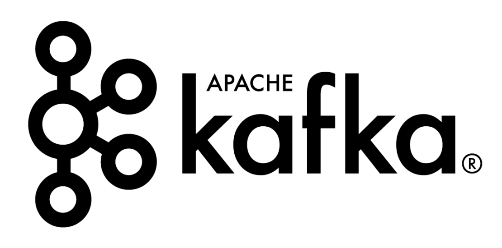

# Apache-Kafka

- Apache Kafka is a distributed streaming platform that provides a unified, high-throughput, low-latency platform for handling real-time data feeds. It is widely used for building real-time data pipelines and streaming applications.

# Important Concepts

## Brokers
- Kafka is designed as a distributed system comprised of one or more servers, called brokers. Brokers are responsible for storing and managing the data streams. They serve as endpoints for producers and consumers to publish and retrieve messages.

## Topics
In Kafka, data is organized and stored in topics. Topics represent a particular stream of data. Each topic can be divided into multiple partitions for better scalability and parallelism.

## Partitioning
Partitioning allows Kafka to distribute the data across multiple brokers for better scalability and performance. Each partition is an ordered, immutable sequence of records that is continually appended to. Partitioning also enables parallelism for both producers and consumers.

## Example:
- Let's consider a scenario where you have a topic named user_activity. This topic could be partitioned based on user IDs. Each partition would then store the activity data for a specific range of user IDs. This way, the load is evenly distributed across partitions, and each broker can handle a subset of the data.

## Use Cases:
### Scalability: Partitioning allows Kafka to scale horizontally by distributing the data across multiple brokers.
Parallel Processing: Each partition can be processed independently, enabling parallelism in both producing and consuming data.
### Fault Tolerance: Replicating partitions across multiple brokers ensures high availability and fault tolerance. If one broker fails, the data can still be retrieved from replicas on other brokers.
Replication
Kafka provides built-in replication to ensure fault tolerance. Each partition can have one or more replicas, with each replica stored on a different broker. Replication ensures that if a broker fails, the data remains available on other brokers.

## Producer and Consumer Client Applications
Kafka provides various client tools and APIs for building producer and consumer applications.

## Tools Available:
Command-line producer and consumer tools: These tools allow you to interact with Kafka from the command line, making it easy to produce and consume messages for testing and debugging.
Kafka Client base Java APIs: These are the core Java APIs provided by Kafka for building custom producer and consumer applications in Java.
Kafka Streams Java APIs: Kafka Streams is a client library for building real-time streaming applications that process data in Kafka topics. It provides high-level APIs for stream processing.
Third-party APIs:
A growing number of third-party client libraries are available in various languages including Python, PHP, C/C++, Go, .NET, and Ruby. These libraries provide additional language support for building Kafka applications.
Learn More

## To learn more about Apache Kafka, you can refer to the following resources:

- Apache Kafka Documentation
- Confluent Kafka Tutorials
- Kafka: The Definitive Guide by Neha Narkhede, Gwen Shapira, and Todd Palino (Book)
- LinkedIn Kafka Series
